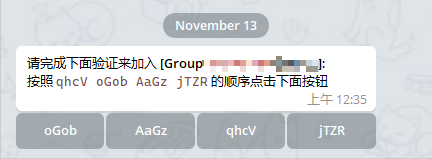

# 这是一份关于[Group Guard Bot](https://t.me/gg_1021_bot)的说明文档

## Bot简介
该Bot用来提供进群验证功能，通过私聊加群用户进行验证流程，以避免像传统Bot在群聊内进行进群验证时，可能对其他正在聊天的用户造成打断。更进一步的是，Bot内置了多组正则表达式，会在用户添加群组，从动词，形容词，名词等多个方面，对用户的**昵称和简介**做匹配，并得出一个敏感值，如果该值大于Bot内预先设定的阈值时，该用户对于该群组会被直接且永久封禁，且不会触发后面的验证流程，当然，这对群组聊天时完全无打扰的。

Bot被赋予 **删除消息** 权限时，Bot会默认开启 **自动删除进群退群消息** 功能。你可以在群组内使用[Bot指令](#关于bot命令)开启或关闭该功能。（**删除消息**权限仅被作用在该功能上）

## Bot功能
- 在用户进群前，对其**昵称和简介**做反Spam分析（该功能默认开启，不可关闭）
- 通过私信来对用户做验证，不对群组聊天进行打扰
- 新进群用户前期发言分析（该功能默认开启，不可关闭）
- 自动删除进群退群消息（该功能默认开启，可手动关闭）

## 如何使用Bot
**前置条件**
- 本Bot只能工作在公共群组 **不支持私有群组和任何频道**
- 群组必须开启 **Approve new member** 功能（这是Bot私聊用户做验证的前提条件，该功能不启用，Bot不能工作）

操作步骤
- 将Bot添加到群组，并设置为管理员，赋予 **删除用户 添加用户 删除消息** 的权限。
- 开启群组的 **Approve new member** 功能 ，Bot依赖该功能来正常工作，群组不开启此功能，Bot无法按预期工作。
**Windows端**在 *群组聊天界面右上角竖三点 -> Manage group -> Group type -> Approve new member* 路径下，如下图所示：

如果你的群组关联了频道，此处的选项，会稍有改变像是这样：

此时如果你打开了 **Only members** 功能，那么只有加入了群组的成员，才能在频道消息内留言回复，如果你在打开 **Approve new members** 的同时，关闭了 **Only members** 功能，**Approve new members** 选项将不可见，但是不用担心，**Approve new members**功能依旧会是开启状态

**其他客户端**可按照上面逻辑推导操作。

## Bot工作原理、流程和功能
当群组开启 **Approve new members** 功能后，用户加群时，需要通过管理员的允许，才能加入群组，而Bot可以接管这个操作。依照Telegram的API设计，Bot在 **Approve new member** 开启时有权限在用户发出添加请求后私聊他们，所以Bot可以在这个时机让用户做验证。

用户添加群组时，会先被Bot分析其基本信息，如**昵称、简介**，Bot会通过内置的多组匹配规则来分析用户的昵称和简介，并根据匹配结果得出一个敏感度值，如果该值大于Bot内预先设定的阈值时，该用户对于该群组会被直接且永久封禁。如果用户的基本信息很健康，Bot会私聊用户，发送如下图所示的信息，来让用户验证，当用户通过后，他们会被拉入群组。如果用户不小心答了答案，他们的验证会被立即刷新，用户会被重新给予一次机会作答，但也会是最后一次机会，如果他们还是答错了，或者在验证开始后的2分钟内未正确作答，Bot将会在该群组封禁该用户5分钟，封禁时间结束后，该用户依旧有机会再次加入群组。

**【该段内容不必详细理解】**关于新进群用户发言分析。新进群的用户，会被Bot持续关注一段时间，这段时间取决于用户的活跃程度，越活越的用户，该时间越短。在被关注时用户发送的媒体消息(图片,视频,文档,@用户,网页链接)会被删除，如果频繁发送，会被封禁。用户的前期非空文字消息，会被Bot做分析，并打分，且打分会被累计。如果在Bot结束关注前，用户的打分超过了阈值，就会被封禁。用户单条消息的打分，分数超过某阈值时，该消息会被删除（如果此时总分不超过阈值，用户暂时不会被封禁）这些规则看起来很严格，但是对于正常用户来说，时很难触发的（当然，完全的避免误判也是不可能的），该功能默认对所有群组开启，且不能关闭。

## 关于bot命令
**下面命令只能在私聊Bot时使用**
- `/ping`：检测Bot的在线状态，Bot工作正常时会回复pong
- `/start`：Bot会对自己做基本的介绍
- `/help`：Bot会做出更详细的介绍，以及加群指导，和本文档的地址

**下面命令为隐藏命令(并未在BotFather注册)，且只能在群组内生效，且只对群组管理员生效，且只能通过`/cmd@bot_username`的方式来触发，如 `/on_del_service_msg@gg_1021_bot`**
- `/refresh_admin`：这会更新群组的管理员列表到Bot的数据库，用来对调用管理员指令的用户身份做判断
- `/on_del_service_msg`：打开**自动删除进群退群消息**，如聊天列表里的 *某某离开了群组*，*某某加入了群组*
- `/off_del_service_msg`：关闭**自动删除进群退群消息**