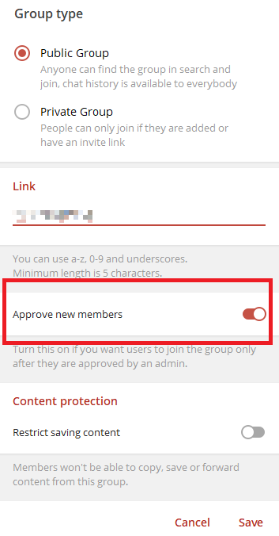
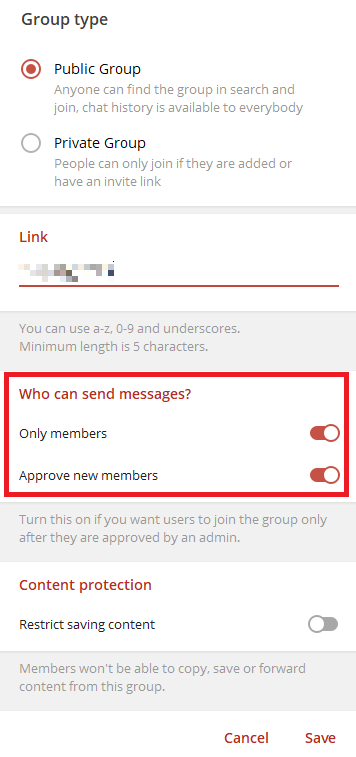
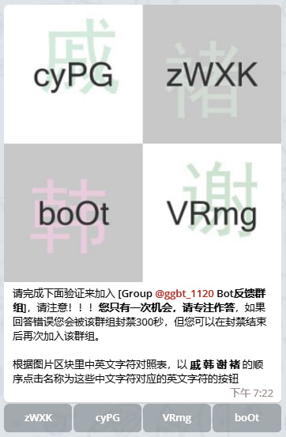

# 这是一份关于[Group Guard Bot](https://t.me/gg_1021_bot)的说明文档

## Bot简介
该Bot用来提供进群验证功能，通过私聊加群用户进行验证流程，以避免像传统Bot在群聊内进行进群验证时，可能对其他正在聊天的用户造成打断。更进一步的是，Bot内置了多组正则表达式，会在用户添加群组时，从动词，形容词，名词等多个方面，对用户的**昵称和简介**做匹配，并得出一个敏感值，如果该值大于Bot内预先设定的阈值时，该用户对于该群组会被直接且永久封禁，且不会触发后面的验证流程，当然，这对群组聊天是完全无打扰的。Bot也会对新加群用户的聊天行为进行短期关注来判断他们是否为Spam。此Bot会为你的群组反Spam能力带来质的提升。

有任何问题和建议可以加入[Bot反馈群组](https://t.me/ggbt_1120)来交流

## 使用须知
- 本Bot只能工作在公共群组 **不支持私有群组和任何频道**
- 群组必须开启 **Approve new member** 功能（这是Bot私聊用户做验证的前提条件，该功能不启用，Bot验证功能不工作）
- 授予Bot所需的权限（**删除用户 添加用户 删除消息**），否则Bot不能正常运行
- **如果您的群组已存在其他Bot接管了群组验证，请先禁用这些Bot的群组验证功能，否则会产生冲突**（指不同Bot频繁对新添加用户进行不一样的权限修改行为，造成非预期的权限结果）
- **Bot不能处理Bot被添加到群组前就已经潜伏在群里的广告**，因为Bot不会监测任何在Bot进入群组前就已在群组内的用户
- **管理员添加的成员，Bot不会对他们做任何后期监测，即使他们是广告**
- Bot在维护重启后，不会处理离线时群组收到的加群请求，因为此时的验证上下文会丢失（Bot的维护计划会在反馈群组公示）
- Bot自身维护了一份黑名单，你可以通过指令查看自己或他人是否在黑名单内

## Bot功能
- Bot禁止用户通过ChatFolder加入群组
- 在用户进群前，对其**昵称和简介等**做反Spam分析（该功能默认开启，不可关闭）
- 被Bot认定为Spam的用户会被加入黑名单，黑名单内的用户在添加任何本Bot接管验证流程的群组时都会被直接封禁
- 通过私信来对用户做验证，不对群组聊天进行任何打扰
- 新进群用户前期发言分析（该功能默认开启，不可关闭）
- 自动删除进群退群消息（该功能默认开启，可手动关闭）

## 关于使用Bot
- 将Bot添加到群组，并设置为管理员，赋予 **删除用户 添加用户 删除消息** 的权限。
- 开启群组的 **Approve new member** 功能 ，Bot依赖该功能来正常工作，群组不开启此功能，Bot无法按预期工作。
**Windows端**在 *群组聊天界面右上角竖三点 -> Manage group -> Group type -> Approve new member* 路径下，如下图所示：

如果你的群组关联了频道，此处的选项，会稍有改变像是这样：

此时如果你打开了 **Only members** 功能，那么只有加入了群组的成员，才能在频道消息内留言回复，如果你在打开 **Approve new members** 的同时，关闭了 **Only members** 功能，**Approve new members** 选项将不可见，但是不用担心，**Approve new members**功能依旧会是开启状态

**其他客户端**可按照上面逻辑推导操作。

## Bot工作原理、流程和功能
当群组开启 **Approve new members** 功能后，用户加群时，需要通过管理员的允许，才能加入群组，而Bot可以接管这个操作。依照Telegram的API设计，Bot在 **Approve new member** 开启时有权限在用户发出添加请求后私聊他们，所以Bot可以在这个时机让用户做验证。

用户添加群组时，会先被Bot分析其基本信息，如**昵称、简介等**，Bot会通过内置的多组匹配规则来分析用户的昵称和简介，并根据匹配结果得出一个敏感度值，如果该值大于Bot内预先设定的阈值时，该用户对于该群组会被直接且永久封禁。如果用户的基本信息很健康，Bot会私聊用户，发送如下图所示的信息，来让用户验证，当用户通过后，他们会被拉入群组。用户只有一次答题机会，答错或者在验证开始后的2分钟内未正确作答，Bot将会在该群组封禁该用户5分钟，封禁时间结束后，该用户依旧有机会再次加入群组。

Bot会完美接管进群验证，超时用户的加群申请会被Bot拒绝从而不会在群聊顶部滞留（这些申请信息只有管理员可见，用户验证失败后Bot会拒绝这些请求记录，以避免这些消息长期滞留于群聊天界面顶部对管理员造成困扰）

**【该段内容不必详细理解】**关于新进群用户发言分析。新进群的用户，会被Bot持续关注一段时间，这段时间取决于用户的活跃程度，越活越的用户，该时间越短。在被关注时用户发送的媒体消息(图片,视频,文档,@用户,网页链接)会被删除。用户的前期文字消息，会被Bot做分析，Bot会根据这些消息的内容决定保留或删除消息，甚至顺带踢掉用户（当这些消息为明显的Spam时）。这些规则看起来很严格，但是对于正常用户来说，是很难触发的（当然，完全的避免误判也是不可能的），该功能默认对所有群组开启，且不能关闭。

Bot禁止用户通过ChatFolder加入群组，这会绕过Bot的验证流程。通过ChatFolder添加群组的用户会被封禁300秒

## 关于bot命令
**下面命令只能在私聊Bot时使用**
- `/ping`：检测Bot的在线状态，Bot工作正常时会回复pong
- `/start`：Bot会对自己做基本的介绍
- `/is_black`：当不加参数时，Bot会回复发送者他是否在黑名单内，当跟上用户ID作为参数时，Bot见回复该ID是否在黑名单内，仅支持一个ID作为参数，示例 `/is_black 1234567890` **(此命令为隐藏命令，并未在BotFather注册)**

**下面命令为隐藏命令(并未在BotFather注册)，且只能在群组内生效，且只对群组管理员生效，且只能通过`/cmd@bot_username`的方式来触发，如 `/set_del_service_msg@gg_1021_bot 1`**
- `/refresh_admin`：这会更新群组的管理员列表到Bot的数据库，用来对调用管理员指令的用户身份做判断。（你通常不需要手动执行此命令，因为Bot被加入群组时会自动执行此命令）
- `/set_del_service_msg`：打开**自动删除进群退群消息**，如聊天列表里的 *某某离开了群组*，*某某加入了群组*，需要提供一个参数来表示开启/关闭，`on`和`1`表示开启，其他任何字符均表示关闭，例如：
  - `/set_del_service_msg@tg_1021_bot on`：开启
  - `/set_del_service_msg@tg_1021_bot 1`：开启
  - `/set_del_service_msg@tg_1021_bot off`：关闭
  - `/set_del_service_msg@tg_1021_bot 0`：关闭
  - `/set_del_service_msg@tg_1021_bot Ciallo～(∠·ω< )⌒☆`：关闭